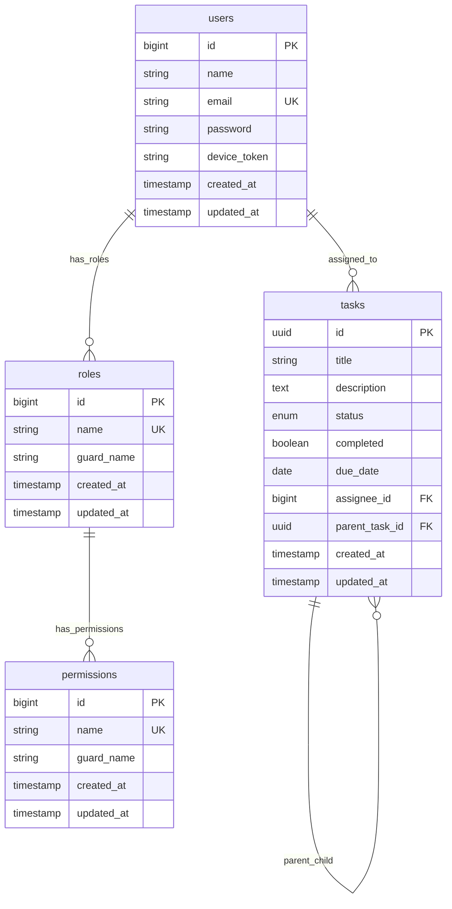

# Visual Example of the ERD

Here's what the simplified ERD looks like when rendered:

## Key Features of This ERD:

### 🔑 Primary Relationships

-   **Users → Tasks**: One user can be assigned to many tasks
-   **Tasks → Tasks**: Self-referencing relationship for parent-child task hierarchy
-   **Users → Roles**: Many-to-many relationship for role-based access control
-   **Roles → Permissions**: Many-to-many relationship for permission management

### 📊 Data Types

-   **UUID**: Used for task IDs for better security and distributed systems
-   **BigInt**: Used for user and role IDs (standard Laravel auto-increment)
-   **Enum**: Task status with predefined values
-   **Boolean**: Task completion flag
-   **Timestamps**: Created/updated tracking for all entities

### 🔒 Security Features

-   **Role-Based Access Control**: Users have roles, roles have permissions
-   **Self-Referencing Tasks**: Parent-child task relationships
-   **Foreign Key Constraints**: Data integrity enforcement
-   **Unique Constraints**: Email uniqueness, role name uniqueness

### 🎯 Business Logic

-   **Task Assignment**: Users can be assigned to tasks
-   **Task Hierarchy**: Tasks can have subtasks (parent-child)
-   **Status Management**: Tasks have lifecycle statuses
-   **Due Date Tracking**: Tasks have deadline management
